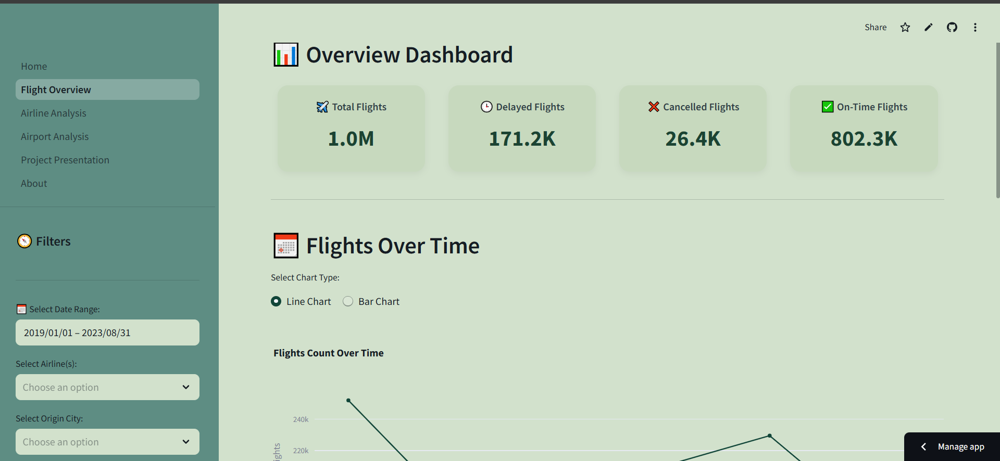

# ✈️ Flight Delay and Cancellation Dashboard

This project presents a full exploratory analysis of flight delays and cancellations in the United States between 2019 and 2023, using an interactive Streamlit web app.

## 📊 Project Highlights

- Real-world dataset (~1 million records) on US flight operations.
- Data cleaning and processing with Pandas.
- Visual exploration using Plotly and Seaborn.
- Key performance indicators for airlines, airports, cancellations, and delays.
- Fully interactive multi-page dashboard using Streamlit.
- Loads large dataset directly from Dropbox for performance and flexibility.

## 🖼️ Preview



## 🌐 Live Demo

You can explore the interactive dashboard here:   
🔗 **[Streamlit App](https://flight-dashboard-aysxp2prniufrfx9aeecyk.streamlit.app/)**

## 📂 Project Structure

```
    ├── Home.py # Main Streamlit app with navigation
    ├── pages/ # Multi-page app components
    │ ├── 1-Flight_Overview.py
    │ ├── 2-Airline_Analysis.py
    │ ├── 3-Airport_Analysis.py
    │ ├── 4-Project_Presentation.py
    │ └── 5-About.py
    ├── .streamlit/config.toml # Streamlit app theme & layout settings
    ├── requirements.txt # Project dependencies
    ├── project_screen.png # Screenshot for preview
    └── Flight_Delay_and_Cancellation.ipynb # Jupyter Notebook for EDA

``` 

## 🚀 How to Run Locally

1. Clone the repository:

```bash
git clone https://github.com/ahmedshlaby/flight-dashboard.git
cd flight-dashboard
pip install -r requirements.txt
streamlit run Home.py
```

ℹ️ Dataset is automatically loaded from Dropbox when you run the app.

## 💼 Technologies Used

- Python
- Pandas, NumPy
- Plotly, Seaborn
- Streamlit
- Dropbox for cloud-based data loading
- Jupyter Notebook
- Git, GitHub

## 🔮 Future Improvements

- Add predictive models for delay classification.
- Include more granular time-based trends (monthly/weekly).
- Add filters for user-customized views in the Streamlit app.

## 👨‍💻 About Me
**Ahmed Ahmed Mohamed Shlaby**  
📧 [shalabyahmed299@gmail.com](mailto:shalabyahmed299@gmail.com)  
💼 [LinkedIn Profile](https://www.linkedin.com/in/ahmedshlaby)  
📁 [GitHub Profile](https://github.com/ahmedshlaby)

⭐ If you like this project, give it a star to support the work!

```